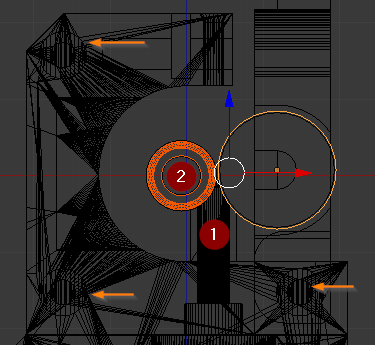

**WARNING: This file is a work in progress and may contain on or two orthographic errors... or maybee more!**

# About
I fork the original because i need a MK8 version, and i test it with the original design and the fitting was to tight.

## Process
With the original STL, i imported to Blender (the program i can use to edit Stl meshes) and moved the holes for the stepper motor 700 microns  to the right like in the orange arrows.

1. Edited the male for the tube to bee taller and then subtract the bering and the gear to have the closest gap possible to try flexible filaments.
2. Mk8 gear

# How to Print

Print with no supports, a temperature resistance material like ASA, ABS, PC, or PETg, with the best resolution possible but you should achive good results with 0.2 layer hight.